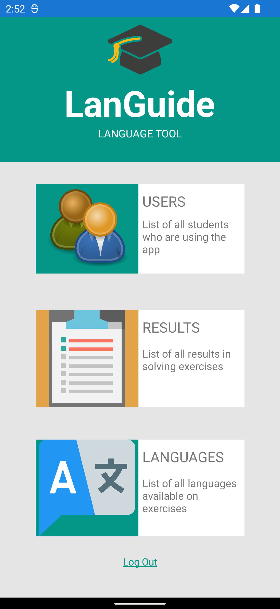

<h1 align="center">
   LanGuide - Final Project
   
</h1>

<h4 align="center">Android application made with <a href="https://dotnet.microsoft.com/en-us/apps/xamarin" target="_blank">Xamarin</a> and <a href="https://firebase.google.com/" target="_blank">Google Firebase</a>.
    Made for android smartphones.</h4>
   

  

## Login info:
Email: admin@admin.com  
Pass: admin123

## API for HTTP get request
https://www.idt.mdh.se/personal/plt01/languide/?get=users - For getting "Users" 
https://www.idt.mdh.se/personal/plt01/languide/?get=results - For getting "Results"
